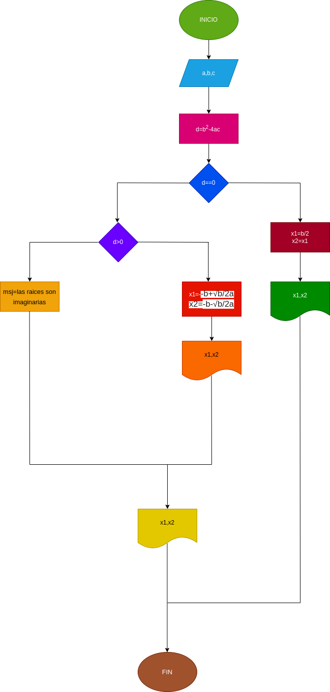

## programa que Calcula e imprime las raíces de la ecuación de segundo grado de coeficientes reales. El programa debe tener en cuenta los diferentes casos que puedan surgir:
# diseño

## diagrama de flujo

